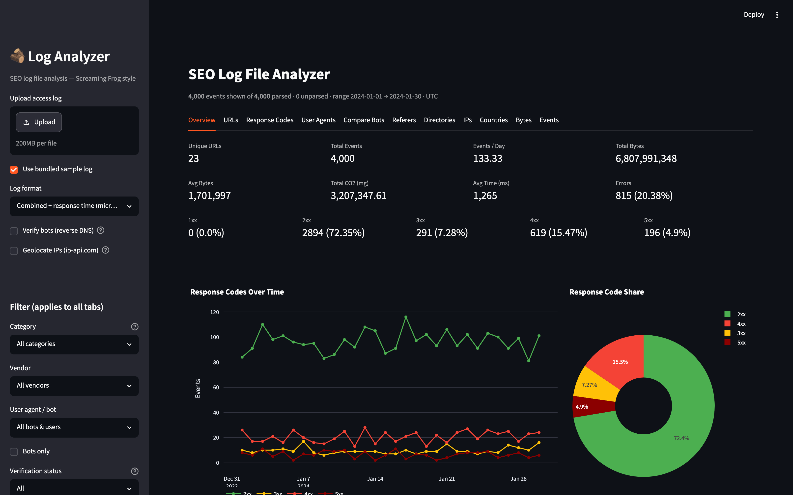

# SEO Log File Analyzer

A Screaming-Frog-style log file analyzer for SEO. Upload a server access log, get
crawl metrics: bot activity, response codes, crawled URLs, directories, bandwidth,
IPs, and geolocation — in an interactive Streamlit dashboard.

Built on **advertools** (parsing) + **pandas** (aggregation) + **Plotly** (charts) + **Streamlit** (UI).



## ✨ Highlights

- **AI crawler detection** — spots and verifies OpenAI (GPTBot, ChatGPT-User…),
  Anthropic (ClaudeBot…), Perplexity, Google AI, Meta, Amazon, ByteDance, Common
  Crawl, and more — each tagged by vendor and purpose (training / search / user-fetch).
  See exactly which AI bots crawl your site and how much.
- **Genuine-bot verification** — confirms a bot is real, not a spoofer: reverse+forward
  DNS for search engines, official published IP-range (CIDR) checks for AI crawlers
  that don't support reverse DNS.
- **Cascading filters** — slice the whole dashboard by Category → Vendor → User agent
  in one click (e.g. "show me every AI Training bot", or "just Googlebot, verified only").
- **Compare Bots** — every bot's crawl footprint side by side, plus a top-URLs × bot
  coverage matrix that reveals which pages a bot never touches.

## Features

| Tab | What it shows |
|-----|---------------|
| **Overview** | Unique URLs, events/day, bytes, CO2, avg response time, response-code split, time-series |
| **URLs** | Per-URL events, bytes, CO2, avg response time |
| **Response Codes** | Counts by status code + time-series by class (2xx/3xx/4xx/5xx) |
| **User Agents** | Per-UA crawl breakdown + **bot verification** (real Googlebot/Bingbot vs spoofers) |
| **Compare Bots** | Crawl footprint of each bot side by side + top-URLs × bot coverage matrix (who hits what, who skips what) |
| **Referers** | Referrer breakdown |
| **Directories** | Crawl rolled up by top-level path |
| **IPs** | Per-IP event + byte counts |
| **Countries** | IP → country geolocation + choropleth map |
| **Bytes** | Bandwidth per URL |
| **Events** | Daily events + per-bot activity over time |

### Bot verification
Two methods, picked automatically per bot:

- **Reverse + forward DNS** — for search engines that support it (Googlebot, Bingbot,
  Applebot, Amazonbot, CCBot, PetalBot). The IP's hostname must end in the official
  suffix (e.g. `googlebot.com`) and forward-resolve back to the same IP.
- **Published IP ranges (CIDR)** — for AI crawlers that don't support reverse DNS
  (OpenAI, Anthropic, Perplexity). The tool downloads each vendor's official IP-range
  JSON and checks the source IP against it.

Either way, spoofers are flagged. Results cached in `.cache/`.

### AI crawler support
Detects and classifies AI/LLM crawlers by vendor and category (training / search /
user-fetch): **OpenAI** (GPTBot, OAI-SearchBot, ChatGPT-User, OAI-AdsBot),
**Anthropic** (ClaudeBot, Claude-User, Claude-SearchBot), **Perplexity**
(PerplexityBot, Perplexity-User), **Google** (Google-CloudVertexBot, GoogleOther),
**Meta**, **Amazon**, **ByteDance** (Bytespider), **Common Crawl** (CCBot), plus
Cohere, DuckAssistBot, Mistral, You.com, Diffbot, Ai2, and more. Robots-only tokens
(`Google-Extended`, `Applebot-Extended`) are flagged as anomalies if seen as a UA.

### Geolocation
IP → country via the free [ip-api.com](http://ip-api.com) batch endpoint (no API key,
~15 batch requests/min). Cached in `.cache/geo.json`. Private IPs are skipped.

## Quick start

Clone, install, and run in one line:

```bash
git clone https://github.com/SEO-max-tech/log-file-analyzer.git && cd log-file-analyzer && python3 -m venv venv && source venv/bin/activate && pip install -r requirements.txt && streamlit run app.py
```

The app opens at `http://localhost:8501` with the bundled sample log pre-loaded.

## Setup (step by step)

```bash
git clone https://github.com/SEO-max-tech/log-file-analyzer.git
cd log-file-analyzer
python3 -m venv venv && source venv/bin/activate
pip install -r requirements.txt
```

## Run

```bash
streamlit run app.py
```

Then in the sidebar: upload an access log (or use the bundled sample), pick the log
format, and optionally enable bot verification / geolocation (slower — they hit the network).

## Log formats

Built-in: NCSA **common**, **combined**, **common_with_vhost**.
Extras: **combined_time** (combined + trailing response time in µs — the sample format),
**combined_msec** (combined + response time in ms).
Or pick **custom** and supply a named-group regex + field list (W3C, CDN logs, etc.).

## Sample data

```bash
python generate_sample_log.py --days 30 --events 4000 --out sample_logs/access.log
```

Generates a realistic combined+time log with Googlebot/Bingbot/human traffic, real
crawler IP ranges, varied response codes and byte sizes.

## Project layout

```
app.py                    Streamlit dashboard (all tabs)
analyzer/
  parser.py               advertools wrapper + normalization
  metrics.py              pandas aggregations
  bots.py                 UA classification + DNS bot verification
  geo.py                  IP → country (ip-api.com + cache)
  charts.py               Plotly figures
generate_sample_log.py    synthetic log generator
sample_logs/access.log    bundled sample
```
